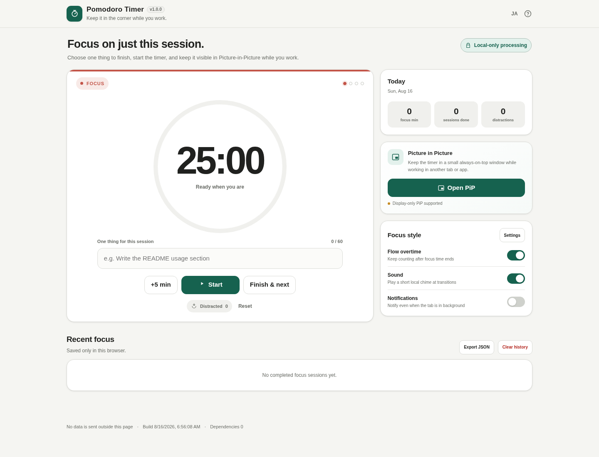

# Pomodoro Timer

[English](README.md)

**作業中も、画面の隅に。**

Picture-in-Picture を中心に設計した、ブラウザだけで使えるポモドーロタイマーです。タイマー、現在の目標、履歴、設定はすべてローカルで処理されます。



## 特徴

- **操作できるPiP** — Document Picture-in-Picture 対応環境では、一時停止・再開・5分追加・完了を小窓から操作できます。
- **PiPフォールバック** — Document PiP 非対応でも、利用可能な環境では Canvas → Video PiP でタイマー表示を維持します。
- **この25分でやること** — 大きなToDo管理は持たず、今の集中対象を1つだけ表示します。
- **Flow延長** — 予定時間が終わっても集中を強制的に切らず、超過時間を `+03:42` のように計測できます。
- **脱線カウンター** — 集中が切れたらワンタップで記録。押し間違いはトーストから元に戻せます。
- **バックグラウンドでもズレにくい** — 終了時刻を基準に残り時間を計算し、タブのスロットリングやスリープ復帰によるズレを抑えます。
- **今日の集計と履歴** — 集中時間、完了セッション、脱線回数、最近の集中をブラウザ内に保存します。
- **ローカル完結** — アカウント、サーバー保存、分析、追跡、外部ランタイム依存はありません。
- **日英切り替え** — 日本語 / English をページ再読み込みなしで切り替えられます。
- **スマホ対応** — 320pxから使えるレスポンシブUIと、スマホ向け固定操作ドックを備えています。

## 使い方

1. `dist/index.html` をブラウザで開きます。
2. 「この25分でやること」に今取り組む1つを入力します。
3. **スタート**を押します。
4. デスクトップでは必要に応じて **PiPで表示** を押し、別のタブやアプリで作業します。
5. 集中が切れたら **気が散った** を1回押します。
6. 終わったら **完了して次へ**。4回目の集中後は長い休憩になります。

## Picture-in-Picture

PiPはブラウザの機能を検出して段階的に有効になります。

| モード | 内容 |
| --- | --- |
| Document Picture-in-Picture | HTMLの小窓を表示。タイマー表示に加えて操作ボタンも利用可能 |
| Video Picture-in-Picture | Canvasで描画したタイマーをVideo PiPへ表示。操作は元画面から行う |
| PiP非対応 | 通常のタイマーとしてそのまま利用可能 |

Document Picture-in-Picture はブラウザ・OS・セキュアコンテキストなどの条件により使えない場合があります。アプリ本体はPiPに依存していません。

## Flow延長

通常のポモドーロでは設定時間が終わると休憩へ進みます。**Flow延長**をONにすると、集中時間が0になった後も `+00:01` からカウントアップし、集中が続いている間はそのまま計測できます。

## キーボードショートカット

| キー | 操作 |
| --- | --- |
| `Space` | 開始 / 一時停止 |
| `P` | PiPを開く / 閉じる |
| `D` | 脱線を記録 |
| `N` | 完了して次へ |

入力欄やボタンにフォーカスしている間はショートカットを発火しません。

## データとプライバシー

設定、現在のタイマー、集中履歴は `localStorage` に保存します。CSPで `connect-src 'none'` を指定し、実行時のネットワーク接続を禁止しています。

- サーバーへのデータ送信なし
- ログインなし
- Analytics / Telemetry なし
- 外部フォント・外部スクリプトなし
- ランタイム依存ライブラリなし

ブラウザデータを削除すると履歴も削除されます。必要な場合はアプリ内の **JSONを書き出す** を利用してください。

## ビルド

Windows PowerShell:

```powershell
.\build-standalone.ps1
```

または:

```bat
build-standalone.bat
```

リポジトリ全体の検証:

```powershell
.\scripts\check-repository.ps1
```

生成物:

- `dist/index.html` — 読みやすい単一HTML
- `dist/index.self-extract.html` — gzip + Base64 の自己解凍版
- `dist/dependency-manifest.json`
- `dist/self-extract-manifest.json`

## GitHub Pages

`main` へのpushでPages用ワークフローが動きます。初回だけ **Settings → Pages → Source: GitHub Actions** を選択してください。Pagesが未設定の場合、ワークフローはビルド成果物を残したうえでデプロイを安全にスキップします。

## 開発方針

このリポジトリは [ttomohisa/htmlapps-template](https://github.com/ttomohisa/htmlapps-template) の構成・思想に準拠しています。

- `src/index.template.html` がソース
- `dist/` は生成物
- 完全内包の単一HTML
- light-only UI
- 日本語 / English
- モバイルファースト
- ローカル処理優先

## ライセンス

MIT License
